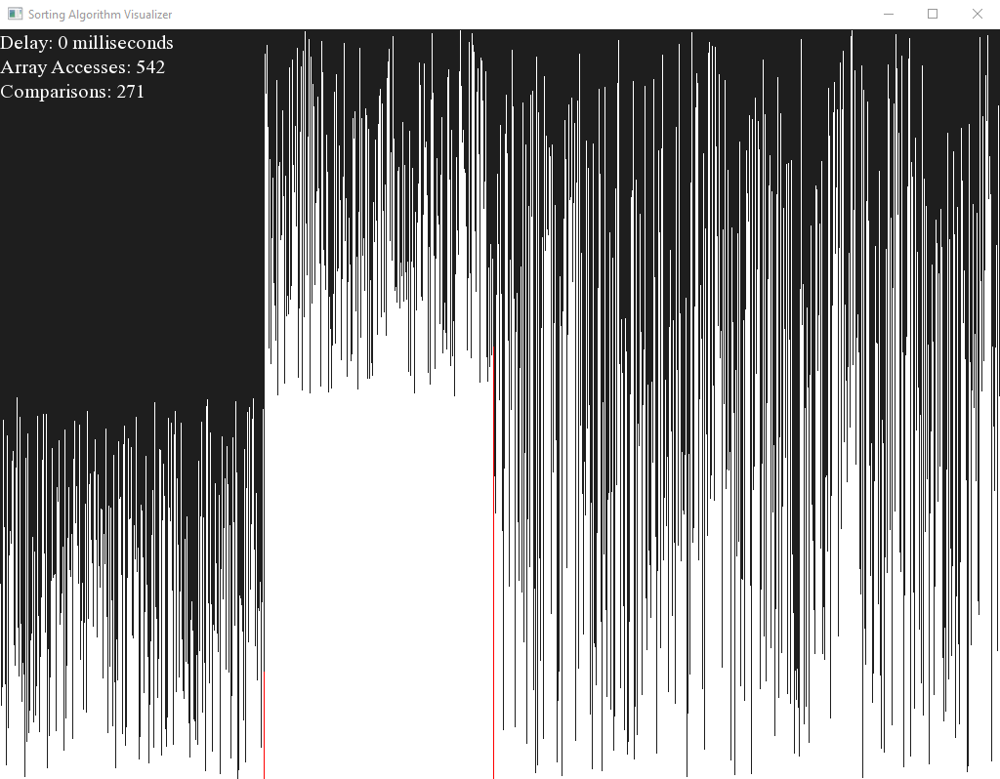

# Sorting Algorithm Visualizer
This is a C++ implentation of a sorting algorithm visualizer

## Features
* Visualizes 8 different sorting algorithms
    * Selection Sort
    * Insertion Sort
    * Bubble Sort
    * Heap Sort
    * Quick Sort
    * Merge Sort
    * Shell Sort
    * Bogo Sort
    * Radix sort
* Command line interface for input
* Allows 2^n nodes per sort, up to n=10

## Screenshots

## Dependencies
The project uses SFML to render the display